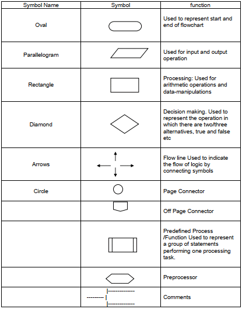
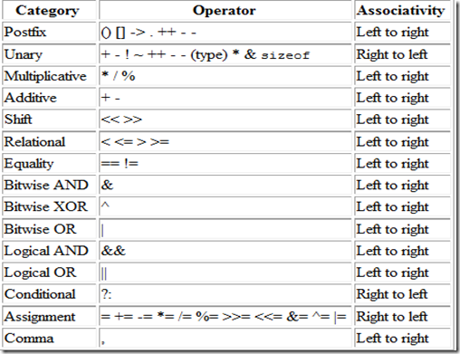

<h2>Pseudo code</h2>
<ul>
  <li>
    <b>FlowChart:</b> It is visual representation of program using diagrams amd shapes having a fixed meaning. 
    Example : In a flow chart the <b>Eclipse</b> denotes the starting and end of the program. 
    <b>Parallelogram</b> denotes the input or output statement.  
    <b>Rectangle</b> denotes the calculation or some arthimatic operations. 
    <b>Rhombus</b> denotes the decision or comparison, etc. 
    <b>Note : There is no symbol or shape for loops but decision shape can be used to make loop.</b>  
    
  </li>
  <li>
    <b>PseudoCode: </b> It is general instructions without any syntax but once it is written it can be easily converted into a code.
  </li>
  <li>
    <b>Programming Languages </b> are special lamguages which can be conberted into computer understandable format which is written in a fix format known as syntax.
  </li>
  <li>
    We know that a computer can perform calculations and other action better than human beings but we can't give instuctions directly to computer as it only understand 0 and 1. so we write a program in a human understandable format and then a program convert it into the computer understandable program this program is known as compiler.
  </li>
</ul>
 
<h6>********************************************</h6>
 
<h2>Pattern in cpp</h2>
<ul>
  <li>
     - <b>First analyse the pattern</b>, see the number of rows and the characters how its printing in what pattern 
     - <b>Create a EQUATION (relation)</b> between the number of columns using the number of rows  
     - Check all iterations 
     - Code while loops, dont forget to add base statements  

 
<h6>********************************************</h6>
 
<h2>Bitwise Operators</h2>
<ul>
  <li>
    - AND
    - OR
    - XOR
    - NOT : an integer is 4 byte in cpp, ie 32 bits
            not operator inverts the bits 0->1 , 1->0 
            Ex. 2- 10 
                ~2=111111111111111111111111111111101

              Now to print: Compiler checks the last bit and finds it is negative, therefore it displays the 2's compliment

                   000000000000000000000000000000010
                                                +  1
                   000000000000000000000000000000011 which is 3, so the compiler displays -3 as answer

    - SHIFT OPERATORS
          Note: when number is small left shifting is multiplying by 2, BUT for lager numbers like 
          010000000000000000000000000000010 , now left shifting to a bit will make it negative

          Note: For positive numbers always the padding is with 0's BUT for <b>negative numbers padding is compiler dependent</b>   

    Genral note: 
    - <b>an int/int always gives an int as answer</b>

    FOR LOOP FLOW: 
      - The initialization statement is executed first is and is executed only once per loop
      - The condition is checked 
      - The body is executed 
      - then updation statement is executed 
      - then condition is checked and so on.                                    
  </li>
</ul>
<h2>Precedence of operators</h2>
<ul>
  <li>
  
  </li>
</ul>